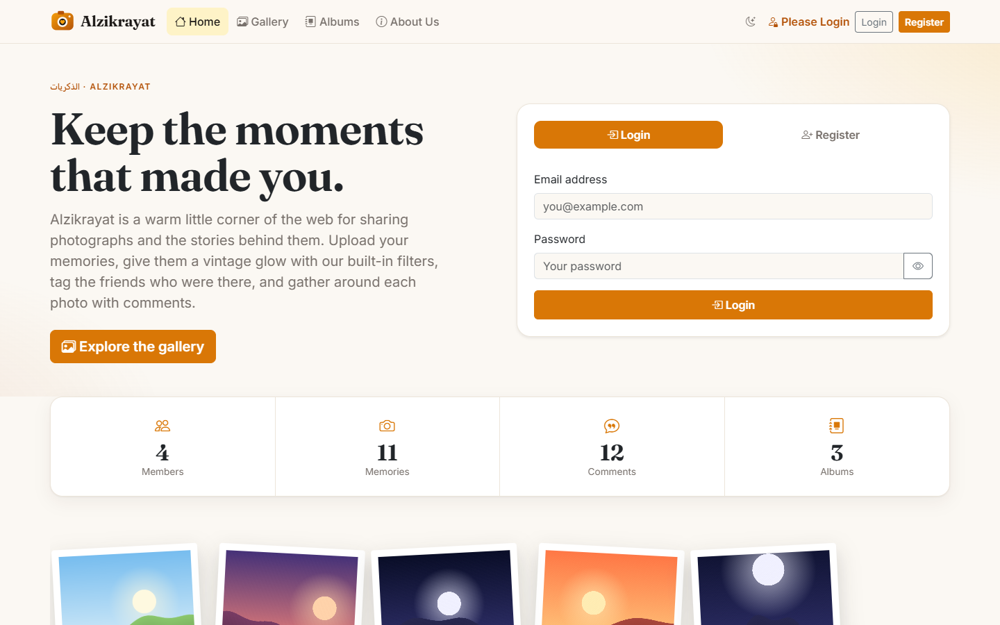
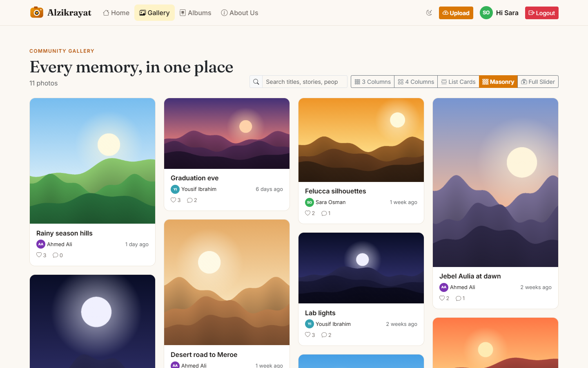
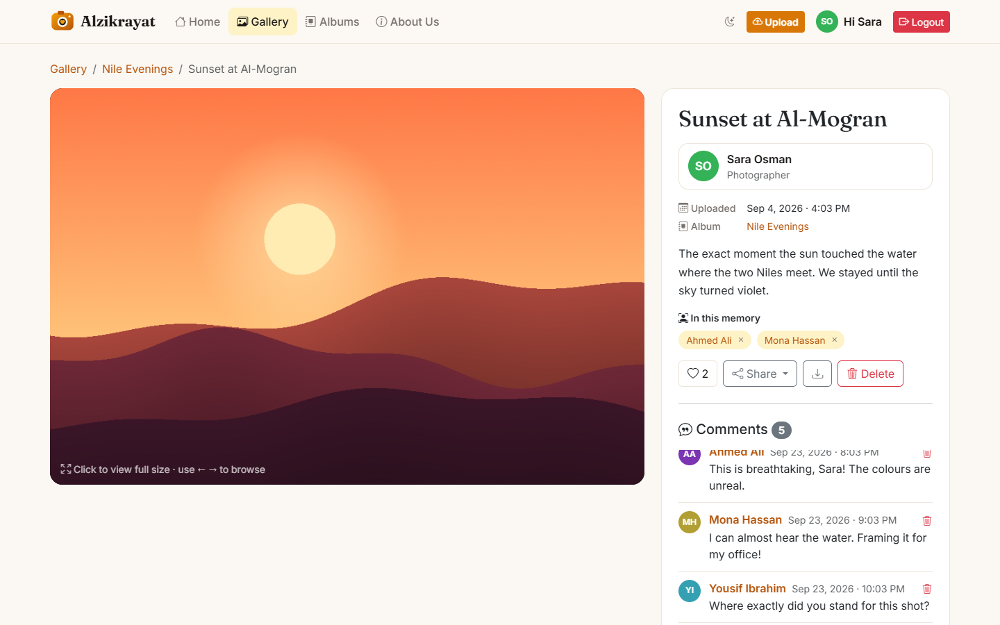
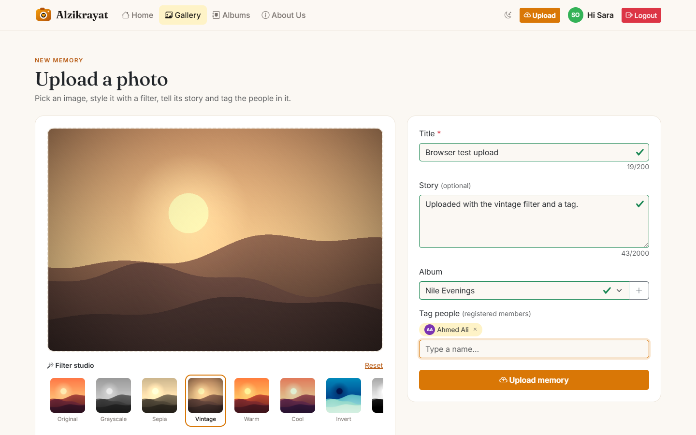
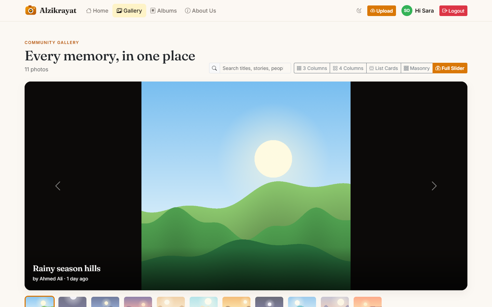

# Alzikrayat (الذكريات): Photo Sharing Application



## Description

**Alzikrayat** ("memories" in Arabic) is a photo sharing web application where members upload photos, tell the story behind them, organise them into albums, tag the friends who appear in them, and talk about them in comments.

It was built for **Course Project 1, Advanced Web Technologies** (SUST, College of CS & IT) with a **hand-written MVC framework** and a **3-tier architecture**. No backend framework, no ORM: the router, controllers, models and views are all written from scratch in plain PHP, and every query is hand-written, parameterised SQL.

### Main features

- Register / login / logout with **bcrypt** password hashing and session-based auth
- Toolbar shows **"Hi &lt;first name&gt;" + Logout** when logged in, **"Please Login"** otherwise
- **"Last login from this computer was …"** cookie (7-day expiry) shown on the login page
- Upload photos (stored in `public/images/uploads/`, metadata in MySQL), view full size, delete **own** photos only
- **Live comments** (AJAX, appear instantly without reload)
- Gallery with **5 display styles**: 3 columns, 4 columns, list cards, masonry, full-width slider
- Landing page with statistics, latest memories and an **About Us** page
- **3 validation layers** on every form: HTML5 → JavaScript → PHP
- Protection against **SQL injection** (prepared statements), **XSS** (`htmlspecialchars` everywhere), **CSRF** (tokens), session fixation and login brute-force

### Novelty features

| Feature | What it does |
|---|---|
| 🎨 **Filter studio** | 13 image filters written by hand on raw canvas pixels: point operations (sepia, vintage, noir…), 3×3 convolution kernels (sharpen, blur, emboss, edge-detect) and spatial effects (vignette, pixelate), plus brightness/contrast sliders. The filtered image is what gets uploaded. |
| 🏷️ **Tag people** | Autocomplete search of registered members; tagged users see the photo under "Tagged in" on their profile. |
| 📚 **Albums** | Group photos into albums and browse each album in any of the 5 display styles. |
| ❤️ **Likes** | AJAX like/unlike with counters and "most loved" photos on the home page. |
| 🔗 **Share** | Cross-post a memory to X (Twitter), Facebook or WhatsApp, the native Web Share sheet, or copy the link. |
| 🌙 **Dark mode**, lightbox with zoom, keyboard navigation (← →), drag-and-drop upload, password strength meter. |

## Technologies

| Layer | Technology |
|---|---|
| Presentation | HTML5, CSS3, **Bootstrap 5.3**, Bootstrap Icons, vanilla **JavaScript** (Canvas API, Fetch API) |
| Application | **PHP 8.1+**: custom MVC framework (Router, Controller, Model, View, Request, Response, Session, Auth, Validator) |
| Data | **MySQL / MariaDB** via **PDO** (native prepared statements, singleton connection) |
| Server | Apache (XAMPP) with `mod_rewrite`, or PHP's built-in server |

## Project structure

```
alzikrayat/
├── config/         config.php (settings), database.php (PDO singleton)
├── core/           Router, Controller, Model, View, Request, Response, Session, Auth, Validator, ImageUploader, helpers
├── controllers/    Home, Auth, Photo, Comment, Album, User, Error controllers
├── models/         User, Photo, Comment, Album, PhotoTag, PhotoLike
├── routes/         web.php: every route declared explicitly
├── views/          layout/, auth/, home/, photos/, albums/, users/, errors/
├── public/         index.php (front controller), .htaccess, css/, js/, images/uploads/
├── database/       schema.sql, seed.php (demo data)
└── docs/           report (PDF) and screenshots
```

## How to run

### Option A: XAMPP (Windows / macOS / Linux)

1. Copy the project folder into XAMPP's `htdocs`, e.g. `C:\xampp\htdocs\alzikrayat`.
2. Start **Apache** and **MySQL** from the XAMPP Control Panel.
3. Create the database: open **phpMyAdmin → Import** and select `database/schema.sql`
   *(or run `mysql -u root < database/schema.sql`)*.
4. *(Optional, recommended)* load demo members, albums and photos:
   ```bash
   cd C:\xampp\htdocs\alzikrayat
   C:\xampp\php\php.exe database/seed.php
   ```
   ⚠️ The seeder **re-creates** the database, so run it only on a fresh install.
5. Open **http://localhost/alzikrayat/** in the browser.

### Option B: PHP built-in server

```bash
mysql -u root < database/schema.sql      # or: php database/seed.php
php -S localhost:8000 -t public public/index.php
```
Then open **http://localhost:8000**.

### Configuration

Database credentials live in `config/config.php` (defaults: host `127.0.0.1`, user `root`, empty password, database `alzikrayat`). They can also be overridden with the environment variables `DB_HOST`, `DB_PORT`, `DB_NAME`, `DB_USER`, `DB_PASS`.

### Demo accounts (after running the seeder)

| Email | Password |
|---|---|
| sara@alzikrayat.test | Password123 |
| ahmed@alzikrayat.test | Password123 |
| mona@alzikrayat.test | Password123 |
| yousif@alzikrayat.test | Password123 |

## Screenshots

| Gallery (masonry) | Photo details & live comments |
|---|---|
|  |  |
| **Filter studio & tagging** | **Full-width slider** |
|  |  |

## Student

- **Name:** Mazin MohamedAhmed Omer MohamedAhmed
- **Student ID:** 202021003245
- **Semester:** 7
- **Course:** Advanced Web Technologies, Sudan University of Science and Technology
